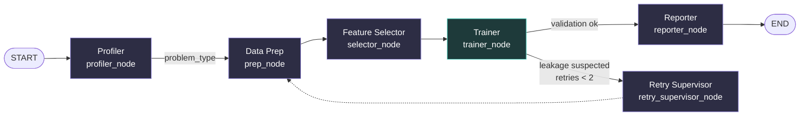
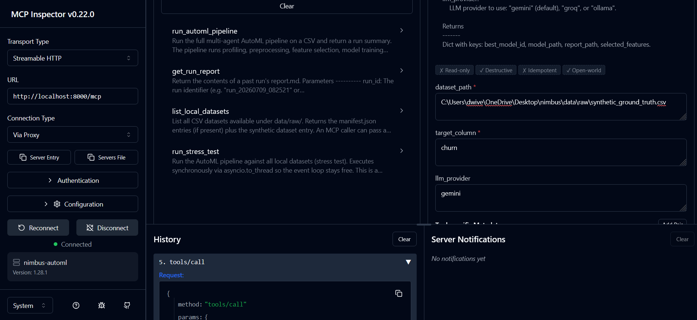

# 🌩️ Nimbus
 
**A multi-agent AutoML pipeline that reasons about your dataset instead of guessing.**
 
CSV in → LLM agents profile it, clean it, select features, train a model battery, tune the winners, and hand you back a report **and a deployable model bundle** — with a bounded retry loop that catches its own mistakes, a sandboxed escape hatch for the transformations no tool library anticipates, and an MCP server that lets other agents call the whole pipeline as a tool.
 
> **6 agents** · **4 stress-tested datasets** · **13 pytest modules** · **bounded 2-retry leakage loop** · **MCP-ready** · **$0 to run**
 
Built on [LangGraph](https://github.com/langchain-ai/langgraph), running on Gemini's free tier by default. Package name is `multiagent-automl`; the project goes by **Nimbus**.
 
---
 
## Table of Contents
 
- [What Nimbus Does](#what-nimbus-does)
- [Why This Exists](#why-this-exists)
- [Architecture](#architecture)
  - [Pipeline Graph](#pipeline-graph)
  - [The Agent Roster](#the-agent-roster)
  - [State Design](#state-design-why-no-dataframe-ever-touches-the-graph)
- [Quick Start](#quick-start)
- [Configuration](#configuration)
- [Project Structure](#project-structure)
- [Deep Dives](#deep-dives)
  - [The Leakage Safety Net](#the-leakage-safety-net)
  - [The Escape Hatch](#the-escape-hatch)
  - [Agent Evaluation](#agent-evaluation)
  - [Experiment Tracking & Cost](#experiment-tracking--cost)
- [Supported Models](#supported-models)
- [Testing](#testing)
- [Known Limitations](#known-limitations)
- [Design Decisions](#design-decisions)
- [Tech Stack](#tech-stack)
- [License](#license)
---
 
## What Nimbus Does
 
```
📁 CSV + target column
    ↓
🔍  Profiler        — statistical EDA + LLM-written concerns (leakage, drop candidates)
    ↓
🧹  Data Prep        — per-column plan: impute / encode / scale / datetime, +escape hatch
    ↓
✂️  Feature Selector — LLM picks a pruning method + threshold, returns rationale
    ↓
🎯  Trainer          — fixed CV model battery, LLM picks the metric, Optuna tunes top-2
    ↓                    → fits winner on full data → saves model.pkl bundle
    ↓
📊  Reporter         — narrative summary + markdown report + MLflow experiment log
```
 
Give it a CSV and a target column name. It tells you whether you're looking at classification or regression, flags anything that smells like target leakage, cleans and encodes the data, picks features, cross-validates a battery of classical models, tunes the best two with Optuna, and writes all of it — decisions, rationale, scores, token cost — into a single markdown report.
 
---
 
## Why This Exists
 
"LLM agent does EDA → cleaning → feature engineering → model selection" is a well-populated category — AutoGen data-science demos, PandasAI-adjacent tools, a dozen "AI Data Scientist" repos. The idea alone doesn't differentiate a project like this. The engineering does: how it handles a dataset it's never seen, how it keeps the LLM from silently doing something wrong, how it bounds cost and latency, and how cleanly the trade-offs can be explained.
 
Nimbus is built around three explicit positions:
 
1. **Reliability over generality.** Agents choose from a deterministic, unit-tested tool library via structured output (Pydantic + `with_structured_output`) instead of writing fresh pandas/sklearn code per dataset. On a free/lite model, arbitrary code generation is fragile — higher error rates, more retry loops, more tokens burned on error correction. A narrow, sandboxed escape hatch exists for the 10% of cases the tool library can't cover (see [The Escape Hatch](#the-escape-hatch)) — but it's not the default path.
2. **Workflow over supervisor, except where routing is genuinely dynamic.** An ML pipeline has a fixed dependency order — you can't select features before cleaning. A fully dynamic "route to any agent at any time" pattern adds LLM calls and latency without adding real flexibility. Nimbus uses a static `StateGraph` for the happy path and reserves actual conditional routing for the two places where it matters: branching on `problem_type`, and a bounded retry loop back to Data Prep when the Trainer's validation step smells leakage.
3. **A strong, well-validated baseline is the goal — not novelty.** For classical ML on a known dataset, the accuracy ceiling is set by the data, not by cleverness. Nimbus's job is to reliably reach that ceiling through correct methodology: proper cross-validation, no leakage, the right metric for the problem. That's a more defensible claim than "achieves best accuracy," and it's more true.
---
 
## Architecture
 
### Pipeline Graph
 

 
*Purple = agentic (LLM structured-output call inside the node). Teal = mostly deterministic. Dashed edge = the bounded retry loop.*
 
Simplified on purpose: `Data Prep`, `Feature Selector`, and `Trainer` are each drawn as one box, but in `pipeline.py` they're registered as **two graph nodes apiece** — `classification_prep`/`regression_prep`, `classification_selector`/`regression_selector`, `classification_trainer`/`regression_trainer` — all pointing at the same underlying function (`prep_node`, `selector_node`, `trainer_node`). `route_after_profiler` picks the branch right after the Profiler; `route_after_supervisor` picks it again on the way back from a retry. Same logic, two node names, so LangGraph's own execution logs stay traceable without duplicating code (see [Design Decisions](#design-decisions)).
 
### The Agent Roster
 
| Stage | Type | Job | LLM calls / run |
|---|---|---|---|
| **Profiler** | Agentic | Deterministic EDA (`tools/profiler.py`) + LLM-written narrative concerns (leakage, drop candidates, imbalance) | 1 |
| **Data Prep** | Agentic | Per-column plan: drop / impute / encode / scale / datetime features, plus an optional sandboxed `custom_code` transform | 1 |
| **Feature Selector** | Agentic | Chooses a pruning method (`variance` / `correlation` / `mutual_info` / `rf_importance` / `none`) + threshold, returns rationale | 1 |
| **Trainer** | Mostly deterministic | Runs a fixed stratified-CV model battery; the LLM only picks the optimization metric; Optuna tunes the top 2 candidates | 0–1 |
| **Retry Supervisor** | Agentic, conditional | Diagnoses which column(s) caused a leakage flag and tells Data Prep what to drop next pass | 0–2 (only fires on failure) |
| **Reporter** | Agentic | Narrative executive summary + recommendations; tables are generated in code, not by the LLM; logs the run to MLflow | 1 |
 
Data Prep intentionally merges cleaning and feature engineering into one agent — both are "what transform on which column" decisions and don't need separate context, so merging them saves a full LLM round trip per run. Typical full run: **5–7 LLM calls**, or up to 9 if the retry loop fires twice.
 
### State Design: Why No DataFrame Ever Touches the Graph
 
`PipelineState` (a `TypedDict` in `schemas.py`) never carries a pandas `DataFrame`. It carries **paths** to parquet snapshots (`runs/{run_id}/02_cleaned.parquet`) and small structured summaries. Two reasons:
 
- **Serialization cost.** LangGraph checkpoints state after every node. Serializing a large DataFrame on every hop creates real latency and memory overhead.
- **Context limits.** Agents reason over `EDAReport` — column names, dtypes, missingness, cardinality, flagged correlations — never raw rows. That keeps prompts small and cheap regardless of dataset size.
The `EDAReport` schema itself has a specific shape for a specific reason. Gemini's structured-output support is a restricted subset of OpenAPI 3.0: it can't represent fixed-length, mixed-type tuples (`tuple[str, str, float]`), and open-ended `dict[str, X]` maps compile to `additionalProperties`, which has historically been a soft spot in structured-output client libraries. So instead of:
 
```python
# Before — dict-keyed, tuple-based: risky for Gemini structured output
class EDAReport(BaseModel):
    dtypes: dict[str, str]
    correlations_flagged: list[tuple[str, str, float]]
```
 
every LLM-facing field is a **list of small typed records**:
 
```python
# After — list-of-records, verified to contain no prefixItems / additionalProperties
class ColumnProfile(BaseModel):
    column: str
    dtype: str
    missing_fraction: float
    cardinality: int
 
class CorrelationPair(BaseModel):
    col_a: str
    col_b: str
    corr: float
```
 
`EDAReport` carries convenience methods (`.dtypes_by_column()`, `.missingness_by_column()`, `.target_balance_by_label()`) so the deterministic tool code can still reconstruct dict lookups locally — the LLM never sees or generates these dicts directly. `tests/test_schemas.py` asserts `EDAReport.model_json_schema()` contains neither `prefixItems` nor `additionalProperties`, as a regression guard.
 
Run configuration (`run_id`, `llm_provider`, `model_name`, `max_retries`, `token_budget`) lives in a separate `RunConfig`, injected read-only via LangGraph's `context_schema` and accessed inside nodes through `runtime.context` — it never pollutes the mutable pipeline state.
 
---
 
## Quick Start
 
**Requirements:** Python 3.12+, [`uv`](https://github.com/astral-sh/uv), and a free API key for at least one provider.
 
```bash
git clone https://github.com/<your-username>/nimbus.git
cd nimbus
 
pip install uv
uv sync
 
cp .env.example .env
# edit .env — add GOOGLE_API_KEY and/or GROQ_API_KEY
 
# fetch the real-world fixture datasets + build the synthetic ground-truth set
uv run nimbus download-data
uv run nimbus generate-data
 
# confirm your provider(s) actually respond
uv run nimbus verify-providers
 
# run the full test suite
uv run pytest tests/ -v
```
 
**Run the pipeline on the built-in synthetic dataset:**
 
```bash
# via the Typer CLI (recommended — single installable entrypoint)
uv run nimbus run --csv data/raw/synthetic_ground_truth.csv --target churn
 
# or via the raw script (still works, no breaking changes)
uv run python scripts/run_pipeline.py \
  --csv data/raw/synthetic_ground_truth.csv \
  --target churn
```
 
This writes `runs/run_{timestamp}/02_cleaned.parquet`, `runs/run_{timestamp}/model.pkl` (the deployable model bundle), and `runs/run_{timestamp}/report.md`, and logs an experiment run to MLflow's local file store. Point it at any CSV of your own the same way:
 
```bash
uv run nimbus run --csv path/to/your_data.csv --target your_target_column
```
 
**Run it across every dataset at once** (the stress-test harness — see [Deep Dives](#deep-dives)):
 
```bash
uv run nimbus stress-test
```
 
**Inspect tracked experiments:**
 
```bash
uv run mlflow ui
# open http://localhost:5000, experiment "nimbus-automl"
```

### CLI Command Reference

Nimbus uses a single unified command-line entrypoint. You can discover commands and options using:

```bash
uv run nimbus --help
```

Here are the commands available:

* **`uv run nimbus run`**
  Runs the multi-agent AutoML pipeline end-to-end on a CSV dataset.
  * Options:
    * `--csv PATH`: Path to raw CSV (default: `data/raw/synthetic_ground_truth.csv`).
    * `--target COL`: Name of the target column (default: `churn`).
    * `--provider PROVIDER`: LLM provider to use (`gemini` | `groq` | `ollama`, default: `gemini`).

* **`uv run nimbus stress-test`**
  Runs the pipeline sequentially across all datasets in the project manifest (`data/raw/manifest.json`), printing a summary table of results and status.

* **`uv run nimbus serve-mcp`**
  Starts the FastMCP tool server.
  * Options:
    * `--transport stdio|streamable-http`: Transport protocol (default: `streamable-http`).
    * `--port PORT`: Port for HTTP transport (default: `8000`).

* **`uv run nimbus verify-providers`**
  Smoke-tests all configured LLM APIs (Gemini, Groq, Ollama) by sending small requests to ensure connectivity and keys are correct.

* **`uv run nimbus generate-data`**
  Generates the synthetic ground-truth dataset (`synthetic_ground_truth.csv` with a leaky column, missing values, etc.) for testing and evals.
  * Options:
    * `--output-dir DIR`: Directory to write output to (default: `data/raw`).
    * `--n-rows INT`: Rows to generate (default: `2000`).
    * `--seed INT`: Random seed (default: `42`).

* **`uv run nimbus download-data`**
  Fetches standard real-world CSV datasets (Titanic, Wine Quality, California Housing) and saves them under `data/raw/` with a manifest.
 
---
 
## Configuration
 
Provider switching is a one-line `.env` change — no code edits, no redeploys.
 
```env
# --- Provider selection ---
LLM_PROVIDER=gemini            # gemini | groq | ollama
 
# --- Gemini — real agent reasoning + final demo (free tier) ---
GOOGLE_API_KEY=your_key_here
GEMINI_MODEL=gemini-3.1-flash-lite
 
# --- Groq — fast, free dev-time iteration (saves Gemini quota) ---
GROQ_API_KEY=your_key_here
GROQ_MODEL=llama-3.3-70b-versatile
 
# --- Ollama — fully local, no API key, no rate limits ---
OLLAMA_MODEL=llama3.1
```
 
| Variable | Required | Default | Notes |
|---|---|---|---|
| `LLM_PROVIDER` | No | `gemini` | Read by `get_llm()` in `llm_client.py` |
| `GOOGLE_API_KEY` | If using Gemini | — | [aistudio.google.com/apikey](https://aistudio.google.com/apikey) |
| `GEMINI_MODEL` | No | `gemini-3.1-flash-lite` | |
| `GROQ_API_KEY` | If using Groq | — | [console.groq.com/keys](https://console.groq.com/keys) |
| `GROQ_MODEL` | No | `llama-3.3-70b-versatile` | |
| `OLLAMA_MODEL` | No | `llama3.1` | Requires a local Ollama server + `langchain-ollama` |
 
The dev workflow this is designed for: iterate against **Groq or Ollama** while building the deterministic tool library and graph wiring (saves Gemini's free-tier quota), switch to **Gemini** once you're testing real agent reasoning, and definitely for any final demo — "runs on a genuinely free hosted model" is the headline claim.
 
Every structured LLM call is wrapped in `llm_retry_decorator` (`tenacity`, 5 attempts, exponential backoff from 4s up to 30s) to absorb the 429s that free tiers hand out under load.
 
---
 
## Project Structure
 
```
nimbus/
├── src/automl_agents/
│   ├── schemas.py             # PipelineState, RunConfig, EDAReport (list-of-records)
│   ├── llm_client.py          # get_llm() provider factory + llm_retry_decorator
│   ├── llm_util.py            # cross-provider token-usage extraction
│   ├── cli.py                 # Day-10: Typer CLI (nimbus run, serve-mcp, etc.)
│   ├── mcp_server.py          # Day-10: FastMCP server (streamable-http + stdio)
│   │
│   ├── tools/                 # deterministic, pure functions — no LLM calls, no graph state
│   │   ├── profiler.py        # dtype inference, missingness, correlation, IQR outliers
│   │   ├── preprocessor.py    # fit/transform split — impute, encode, scale, datetime features
│   │   ├── selection.py       # variance / correlation / mutual_info / rf_importance pruning
│   │   ├── training.py        # stratified-CV model battery + Optuna tuning + _build_estimator
│   │   ├── model_export.py    # Day-10: fit_final_model, save/load/predict_from_bundle
│   │   ├── custom_transform.py# sandboxed subprocess code execution (the escape hatch)
│   │   └── eval.py            # run_agent_evals — rubric-based agent-reasoning scorer
│   │
│   ├── nodes/                 # LangGraph nodes — tool calls wrapped in LLM structured output
│   │   ├── profiler.py        # profiler_node + ProfilerAnalysis
│   │   ├── prep.py            # prep_node + PrepPlanSchema / ColumnPrepAction
│   │   ├── selector.py        # selector_node + SelectorDecision
│   │   ├── trainer.py         # trainer_node + TrainerMetricSelection + leakage + model export
│   │   ├── supervisor.py      # retry_supervisor_node + SupervisorDecision
│   │   └── reporter.py        # reporter_node + ReportExecutiveSummary + MLflow logging
│   │
│   └── graph/
│       └── pipeline.py        # StateGraph wiring, conditional routing, retry loop
│
├── tests/                     # pytest — mirrors src/ layout, unit + integration
├── scripts/
│   ├── run_pipeline.py        # CLI entrypoint — single dataset, single run
│   ├── stress_test.py         # runs the graph across every dataset in the manifest
│   ├── run_battery_standalone.py  # Day-4 tools without the graph, for isolated debugging
│   ├── download_datasets.py   # fetches titanic / wine_quality_red / california_housing
│   ├── generate_synthetic.py  # builds the ground-truth synthetic churn dataset
│   └── verify_providers.py    # smoke-tests every configured LLM provider
│
├── data/raw/                  # CSVs + manifest.json (gitignored, generated by scripts)
├── runs/                      # per-run parquet snapshots, report.md, model.pkl, mlruns/
└── pyproject.toml
```
 
---
 
## Deep Dives
 
### The Leakage Safety Net
 
Target leakage is the failure mode most "AI does ML" demos get caught on. Nimbus checks for it twice, automatically, every run:
 
1. **Correlation check** (`trainer_node`) — every selected feature's correlation with the target is computed; anything ≥ **0.99** is flagged.
2. **Perfect-score check** (`trainer_node`) — any non-SVM/SVR model hitting a CV score ≥ **1.0** on accuracy/F1 (classification) or R² (regression) is flagged. SVM/SVR are excluded because their scoring surface can legitimately saturate on easy synthetic data.
If either check fires, `route_after_trainer` sends the run to the **Retry Supervisor** instead of the Reporter — but only if `retry_count["data_prep"] < 2`. The Supervisor is a genuine LLM decision point (not a hardcoded rule): it receives the `validation_errors`, the current `eda_report.concerns`, and the selected features, and returns which column(s) to drop and why. It appends that explanation directly to `eda_report.concerns`, and the graph loops back to Data Prep — which reads the updated concerns and naturally incorporates them into its next `PrepPlanSchema`, without any special-cased "second pass" logic.
 
If the bound is hit, the loop stops and routes to the Reporter regardless, so a stubborn leakage case degrades to *"reported with a known caveat"* rather than an infinite retry loop racking up API bills.
 
Underlying discipline that makes this trustworthy in the first place: **every transformer is fit on the training data and only applied — never refit — on validation folds.** `fit_preprocessor` computes statistics (medians, encoder categories, scaling parameters) once and stores them in `PrepArtifacts`; `transform_preprocessor` applies those stored parameters without recalculating anything. This is the single most common bug in "AI does ML" demos, and it's handled at the tool-library level, not left to agent discretion.
 
### The Escape Hatch
 
Standard tools (impute, encode, scale, datetime parsing) cover most columns. For the rest — a malformed date format, an embedded ratio the standard tools can't express — the Data Prep agent can emit a `custom_code` string, executed by `run_custom_transform_sandboxed`:
 
```python
def run_custom_transform_sandboxed(
    code_str: str,
    df: pd.DataFrame,
    timeout_sec: int = 30,
) -> pd.DataFrame:
    ...
```
 
Isolation model:
- The DataFrame is round-tripped through **parquet snapshots** in a temp directory — never shared memory.
- Code runs in a **separate subprocess** (`subprocess.run([sys.executable, script_path], timeout=..., check=True)`), not `exec()` in the parent process.
- `socket`, `urllib`, `http`, `requests`, `ftplib`, `smtplib`, `subprocess`, and `shutil` are neutered inside the sandbox (`sys.modules[m] = None`) before the user code runs, blocking the obvious network/filesystem escape routes.
- A hard timeout (default 30s) kills runaway loops; both `TimeoutExpired` and `CalledProcessError` are caught and re-raised as clean `RuntimeError`s.
It's a **best-effort enhancement**, not a required step: it runs *after* the deterministic `fit_preprocessor`/`transform_preprocessor` pass, on an already-valid dataset. If the LLM-generated code fails — references a column already consumed by `datetime_cols`, hits a syntax error, times out — `prep_node` catches it, logs a warning, and continues with the standard-transform output rather than failing the whole stage. Custom code is an escape hatch, not a single point of failure.
 
### Agent Evaluation
 
Prompt tweaks and model upgrades can quietly regress agent reasoning. `run_agent_evals` is a lightweight CI-style rubric run against the synthetic ground-truth dataset (which has a *known-correct* answer key by construction):
 
| Check | Passes when |
|---|---|
| `leakage_detection` | `"leaky_churn_copy"` appears in `prep_plan["drop_cols"]` |
| `imputation_validity` | An imputation strategy was assigned to `annual_income` or `tenure_months` (both have injected nulls) |
| `problem_type_inference` | `eda_report.problem_type == "classification"` |
 
Returns a `pass_rate` and a per-check breakdown. `scripts/stress_test.py` runs this automatically for the synthetic dataset and treats anything below a 100% pass rate as a stress-test failure — a real regression gate, not just a smoke test.
 
### Experiment Tracking & Cost
 
Every run is logged to a local MLflow file store, experiment name **`nimbus-automl`**, from inside `reporter_node`:
 
- **Params:** target column, dataset path, best model ID, LLM provider/model, scaling strategy, IQR clip factor, dropped-column count, selected-feature count.
- **Metrics:** total LLM tokens consumed (input + output, summed across every agent call this run), number of Data Prep retry cycles, mean and std CV score per model per metric (baseline and Optuna-tuned candidates alike).
- **Artifacts:** the generated `report.md`, the cleaned parquet snapshot, and the `model.pkl` bundle (Day-10).
Every structured LLM call appends a `TokenUsageEntry` to `state["token_usage"]` (an `operator.add`-reduced list, so nodes append rather than overwrite). `llm_util.extract_token_usage` normalizes the field names across providers — Gemini's `usage_metadata` (`prompt_tokens` / `candidates_tokens`) vs. Groq's `token_usage` (`prompt_tokens` / `completion_tokens`) — so the final report's token table is provider-agnostic. That table turns a free-tier budget constraint into a concrete artifact: a real cost/latency breakdown per pipeline stage, generated automatically on every run.
 
### Running Nimbus as an MCP Server
 
Nimbus exposes the full pipeline as an MCP server so external agents (Claude Desktop, Claude Code, or any MCP client) can call it as a tool:
 
```bash
# Start the server (default: streamable-http on port 8000)
uv run nimbus serve-mcp
 
# Or via stdio for local Claude Desktop subprocess integration
uv run nimbus serve-mcp --transport stdio
```
 
**Exposed tools** (4 total, narrow surface — no file-write/delete tools):
 
| Tool | What it does |
|---|---|
| `run_automl_pipeline` | Runs the full LangGraph pipeline on a CSV. Returns `best_model_id`, `model_path`, `report_path`, `selected_features`. |
| `get_run_report` | Returns the markdown contents of a past run's `report.md`. |
| `list_local_datasets` | Lists all CSVs available under `data/raw/` (reads `manifest.json`). |
| `run_stress_test` | Runs the pipeline against all local datasets (long-running). |
 
**Security:** `dataset_path` is validated against an allow-list directory (`data/raw/`) — arbitrary filesystem paths are rejected before the graph ever runs. This matters since the default transport is network-reachable.

#### Testing the MCP Server with MCP Inspector

You can test and run tool calls against the server interactively without configuring a full client or Claude Desktop using the official `@modelcontextprotocol/inspector`:

1. Start the Nimbus MCP server in one terminal:
   ```bash
   uv run nimbus serve-mcp
   ```
2. In a separate terminal, launch the Inspector:
   ```bash
   npx @modelcontextprotocol/inspector
   ```
3. Open the displayed URL (usually `http://localhost:6274`) in your browser.
4. In the connection pane (left sidebar):
   * Select **Streamable HTTP** as the *Transport type*.
   * Enter the URL: `http://localhost:8000/mcp` (Ensure you append `/mcp` to the host/port).
   * Click **Connect**.
5. You can now browse the schema and test calls to any of the 4 tools.

<p align="center">
  
</p>
 
**Claude Desktop config** (streamable-http):
```json
{
  "mcpServers": {
    "nimbus": {
      "url": "http://localhost:8000/mcp/"
    }
  }
}
```
 
### Downloading and Using a Trained Model
 
Every successful pipeline run now saves a self-contained model bundle at `runs/{run_id}/model.pkl`. The bundle contains the fitted model **plus** the exact preprocessing artifacts used during training, so raw CSV rows can be transformed and predicted on identically:
 
```python
from automl_agents.tools.model_export import load_model_bundle, predict_from_bundle
import pandas as pd
 
# Load the bundle
bundle = load_model_bundle("runs/run_20260709_082521/model.pkl")
print(bundle["model_id"])         # e.g. "LightGBM (Tuned)"
print(bundle["selected_features"])# features the model was trained on
 
# Predict on new, raw CSV rows — preprocessing is applied automatically
new_data = pd.read_csv("new_customers.csv")
predictions = predict_from_bundle(bundle, new_data)
print(predictions)                # array of class labels or regression values
```
 
**What's inside the bundle** (a plain dict, not a custom class):
 
| Key | Contents |
|---|---|
| `model` | Fitted scikit-learn-compatible estimator |
| `prep_artifacts` | The exact `PrepArtifacts` from fit-time (imputer fills, encoder mappings, scaler params) |
| `selected_features` | Ordered list of feature column names |
| `target_column` | Name of the target column |
| `problem_type` | "classification" or "regression" |
| `model_id` | Human-readable model identifier (e.g. "LightGBM (Tuned)") |
 
 
## Supported Models
 
| Classification | Regression |
|---|---|
| LogisticRegression | LinearRegression |
| RandomForest | RandomForest |
| GradientBoosting | GradientBoosting |
| XGBoost | XGBoost |
| LightGBM | LightGBM |
| SVM | SVR |
| KNN | KNN |
 
Metrics: **accuracy, f1** for classification · **mae, rmse, r2** for regression. The Trainer agent picks which one to optimize based on the target's class balance (or problem type for regression) — it's instructed to prefer F1 over accuracy once class imbalance is meaningful, since accuracy is misleading on skewed targets. The top 2 candidates by the chosen metric are re-tuned via Optuna (10 trials, TPE sampler) *inside* the CV folds, so tuning never sees held-out data.
 
---
 
## Testing
 
```bash
uv run pytest tests/ -v
```
 
| File | Covers |
|---|---|
| `test_setup.py` | Core dependency imports, schema instantiation, clear-error-on-missing-API-key |
| `test_schemas.py` | `EDAReport` JSON schema has no `prefixItems`/`additionalProperties` (Gemini-safety regression guard) |
| `test_profiler.py` | Dtype inference, missingness, correlation flags, IQR outliers — across synthetic, Titanic, Wine, California datasets |
| `test_preprocessor.py` | Fit/transform split, imputation, encoding, scaling, datetime feature extraction |
| `test_selection.py` | Variance/correlation/mutual-info/RF-importance pruning correctness |
| `test_training.py` | Model battery output shape, metrics present, empty-feature-set error handling |
| `test_escape_hatch.py` | Sandbox success, syntax errors, timeouts, blocked-module isolation, `run_agent_evals` scoring |
| `test_mlflow_logging.py` | Optuna tuning output shape, `llm_retry_decorator` backoff behavior, MLflow run/param/metric assertions |
| `test_retry_path.py` | Routing functions, trainer leakage-detection logic, supervisor decision handling, a **live** end-to-end retry-loop run |
| `test_agent_decisions.py` | Live leakage-detection integration test across Groq and Gemini |
| `test_pipeline.py` | Full end-to-end graph run — asserts every stage logs `"ok"` and produces its expected output |
| `test_model_export.py` | Day-10: `_build_estimator` param honouring, full bundle round-trip (fit→save→load→predict), invalid bundle detection |
| `test_mcp_server.py` | Day-10: path allow-list enforcement, `list_local_datasets`, `get_run_report` error handling |
| `test_cli.py` | Day-10: Typer CliRunner tests for all subcommand `--help` + `generate-data` + error exit codes |
 
Tests marked "live" hit a real LLM provider and require a valid API key in `.env`.
 
---
 
## Known Limitations
 
Stated plainly, because knowing the limits of what you built is worth more than pretending it's production-ready:
 
- **CSV-only input.** No SQL/Postgres/Excel/vector-DB ingestion yet.
- **No deep learning / time-series.** Classical tabular ML only, by design (see [Why This Exists](#why-this-exists)).
- **CPU-bound, sequential agents.** No GPU path, no parallel agent execution — each stage waits on the previous one.
- **`RunConfig.max_retries` is currently unused.** The actual retry bound is hardcoded to `2` inside `route_after_trainer`; wiring the context value through is a natural follow-up rather than a design requirement.
- **`RunConfig.token_budget` is tracked but not enforced.** Token usage is logged per stage and totaled in the report, but no code path currently halts a run for exceeding it.
- **CV folds are hardcoded to 3** inside `trainer_node`, not exposed via `RunConfig`.
- **Dataset battery covers 4 of the ~6–8 datasets** the original roadmap called for (Titanic, Wine Quality, California Housing, synthetic churn). `stress_test.py` already has a dangling reference to a `"telco_churn"` dataset ID for eval purposes — Adult Census Income, Telco Churn, and Credit Card Fraud (a genuine imbalance stress test) are the natural next additions.
- **No human approval gate** before a prep plan or custom transform is applied.
---
 
## Design Decisions
 
**Why multi-agent instead of one agent with a big prompt?**
Context isolation per stage means smaller, more reliable structured outputs per call, and the ability to unit-test and swap individual stages independently — a bad Feature Selector decision doesn't require re-prompting the whole pipeline's context.
 
**Why not let it write arbitrary code as the default path?**
Reliability and testability, on a small/free model. Full code-gen is more impressive-looking but fragile — higher error rates, more retry loops, more tokens burned on error correction, and much harder to unit test than a fixed tool library with a narrow, sandboxed escape hatch for the genuine long tail.
 
**How do you know it's not leaking or overfitting?**
Fit-on-train-only discipline is enforced at the tool-library level (`PrepArtifacts` stores fit statistics, `transform_preprocessor` only ever applies them), plus a two-layer leakage check in the Trainer (correlation ≥ 0.99, perfect CV score) that's independent of what the Data Prep agent claims it did.
 
**What happens when an agent is wrong?**
Two different failure modes, two different answers. A leakage-suspicious result triggers the bounded Retry Supervisor loop (max 2 attempts, then reports with a caveat rather than looping forever). A broken `custom_code` string from Data Prep is caught locally and skipped — the already-valid deterministic output is kept, and the stage continues instead of crashing the run.
 
**What would you change for production?**
A bigger, paid model for the reasoning-heavy Profiler step; real sandboxing (gVisor/Firecracker-grade, not just subprocess isolation) for the code-execution escape hatch; a human approval gate before applying transformations to real data; moving from file-based state to a proper job queue; wiring `max_retries` and `token_budget` through instead of leaving them as unused config fields.
 
---
 
<details>
<summary><strong>Full list (click to expand)</strong></summary>

<table>
  <thead>
    <tr>
      <th>Layer</th>
      <th>Choice</th>
    </tr>
  </thead>
  <tbody>
    <tr>
      <td>Orchestration</td>
      <td>LangGraph (<code>StateGraph</code>, conditional edges for the retry path)</td>
    </tr>
    <tr>
      <td>LLM (primary)</td>
      <td>Gemini 3.1 Flash-Lite (free tier) via <code>langchain-google-genai</code></td>
    </tr>
    <tr>
      <td>LLM (dev-time)</td>
      <td>Groq free tier (Llama 3.3 70B) or local Ollama</td>
    </tr>
    <tr>
      <td>Structured outputs</td>
      <td>Pydantic + <code>with_structured_output</code></td>
    </tr>
    <tr>
      <td>Resilience</td>
      <td><code>tenacity</code> (exponential backoff on all LLM calls)</td>
    </tr>
    <tr>
      <td>Data handling</td>
      <td><code>pandas</code>, <code>pyarrow</code> (parquet snapshots)</td>
    </tr>
    <tr>
      <td>Classical ML</td>
      <td>scikit-learn, XGBoost, LightGBM</td>
    </tr>
    <tr>
      <td>Hyperparameter tuning</td>
      <td>Optuna (local, TPE sampler)</td>
    </tr>
    <tr>
      <td>Feature selection</td>
      <td>scikit-learn (<code>mutual_info</code>, <code>VarianceThreshold</code>), <code>feature-engine</code></td>
    </tr>
    <tr>
      <td>Experiment tracking</td>
      <td>MLflow (local file-store mode)</td>
    </tr>
    <tr>
      <td>Testing</td>
      <td>pytest, pytest-cov</td>
    </tr>

    <tr>
      <td>Package management</td>
      <td><code>uv</code></td>
    </tr>
    <tr>
      <td>CLI</td>
      <td><code>Typer</code> + <code>rich</code> (Day-10: replaces scattered <code>argparse</code> scripts)</td>
    </tr>
    <tr>
      <td>MCP</td>
      <td><code>FastMCP</code> server (streamable-http + stdio) for external agent integration</td>
    </tr>
    <tr>
      <td>Model persistence</td>
      <td><code>joblib</code> — model + <code>PrepArtifacts</code> bundle</td>
    </tr>
  </tbody>
</table>

</details>
 
## License
 
MIT — see [LICENSE](LICENSE) for details.
 
